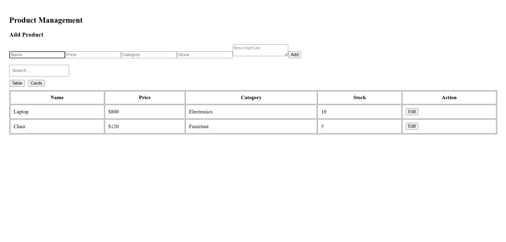
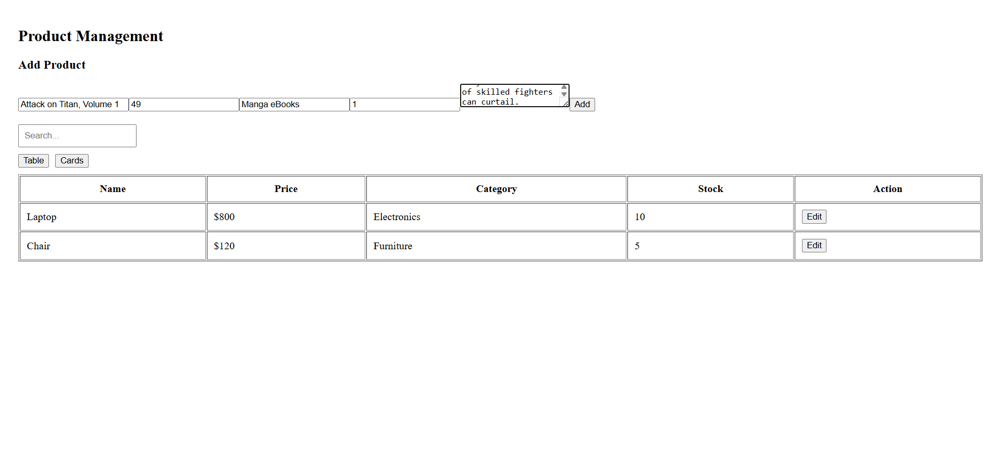
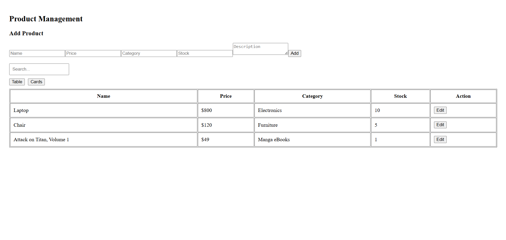

# Product Assignment for Grey Scientific Labs ✅

**A clean, focused UI for listing and managing products built with Vite + React.**

| Home Page | Code Generation | Fullscreen Preview |
|-----------|----------------|-------------------|
|  |  |  |

---

## ✨ Project Overview

This repository contains a small React app to display products, add new products, and view them in different layouts (cards & table). The project is scaffolded with Vite for a fast development experience.

## 🗂️ Project Structure

```
product-assignment/
├─ public/
├─ src/
│  ├─ assets/
│  ├─ component/
│  │  ├─ ProductCards.jsx
│  │  ├─ ProductForm.jsx
│  │  └─ ProductTable.jsx
│  ├─ App.jsx
│  ├─ App.css
│  ├─ index.css
│  └─ main.jsx
├─ index.html
├─ package.json
├─ vite.config.js
└─ README.md
```

> The `component/` folder contains the main UI components: cards, table and the form for adding products.

## 🚀 Getting Started

### Prerequisites
- Node.js 16+ (recommended)
- npm or yarn

### Install

```bash
npm install
# or
# yarn
```

### Run locally

```bash
npm run dev
```

Then open http://localhost:5173 in your browser.

### Build for production

```bash
npm run build
```

### Preview production build

```bash
npm run preview
```

## 🧩 Features

- Add a product using a simple form
- View products in **cards** or **table** format
- Responsive UI with basic styling

## 🛠️ Tech Stack

- React
- Vite
- JavaScript (JSX)
- CSS

## 💡 Tips

- Check `src/component/ProductForm.jsx` for form validation and submit logic.
- Components are small and focused—good starting point to expand features like edit/delete or persistence.

## 📄 License

This project has no license specified. Add one if you plan to publish or share it.

---

If you'd like, I can also:
- add a project screenshot
- improve styling and responsiveness
- add tests or a small demo dataset

Happy to continue—tell me which improvement you want next! 🔧